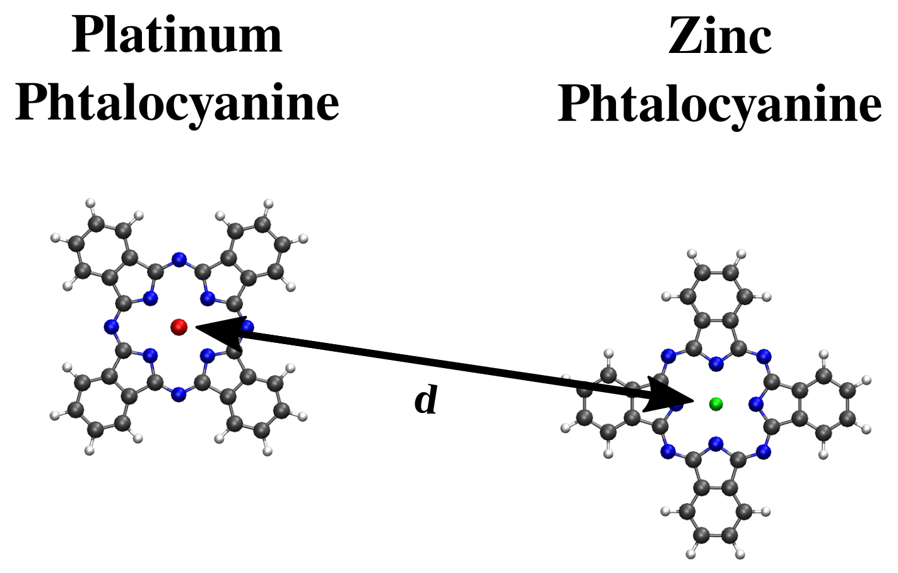
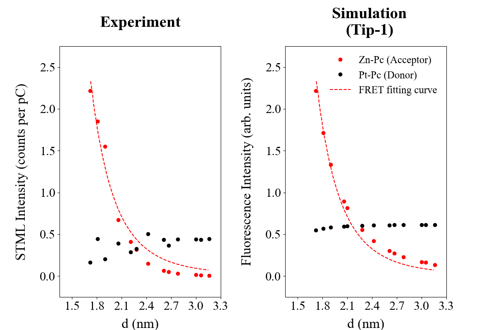

# Tip-Enhanced FRET Spectra

## Objective

The goal of this repository is to reproduce **Figure 2b** from the paper:
**Kong, FF., Tian, XJ., Zhang, Y. et al.**
**Wavelike electronic energy transfer in donor–acceptor molecular systems through quantum coherence**
*Nat. Nanotechnol. 17, 729–736 (2022)*
[https://doi.org/10.1038/s41565-022-01142-z](https://doi.org/10.1038/s41565-022-01142-z)

---

## Description

This code reads **fluorescence descriptors**—including the absorption coefficient, radiative decay rate, and non-radiative decay rate—computed at the **Time-Dependent Density Functional Theory (TDDFT)** level. It also reads **electronic energy transfer rates** between two phthalocyanine molecules, calculated using the [**FretLab**](https://github.com/pgrobasillobre/FretLab) code.

Below is a schematic of the donor–acceptor molecules at a given distance **d** calculated with respect to the two phthalocyanine centers:

<p align="center">
  
</p>


The simulation models **tip-mediated fluorescence spectra**, with a silver tip positioned directly above the donor molecule at a vertical distance of **0.5 nm** from the central platinum atom. The donor and acceptor are separated by a variable metal–metal distance, defined as the separation between the central Pt and Zn atoms of the respective phthalocyanines, consistent with the experimental setup.

Simulated fluorescence intensities of the donor and acceptor molecules are plotted as a function of the intermetallic distance between phthalocyanines and compared to experimental data. The **simulated intensities are normalized maximum experimentally observed intensity** for the acceptor.

---

## Data Sources

- **Fluorescence descriptors (TDDFT)** computed using **Amsterdam Modeling Suite**
  - Reference: **P. Grobas Illobre**, P. Lafiosca, T. Guidone, F. Mazza, T. Giovannini, C. Cappelli *Nanoscale Adv., 2024, 6, 3410* [https://doi.org/10.1039/D4NA00080C](https://doi.org/10.1039/D4NA00080C)

- **Electronic energy transfer rates (FretLab)**:
  - Repository: [https://github.com/pgrobasillobre/FretLab](https://github.com/pgrobasillobre/FretLab)


---

## Requirements

- Python ≥ 3.8
- numpy
- matplotlib
- pandas

---

## Usage

An example simulation is provided in the `data/simulation/` directory. Ensure the following folder structure:

```
simulation/
├── tddft/
│   ├── pt-pc
│   │   └── state-1/2/*log
│   └── zn-pc_d-1.72
│       └── state-1/2/*log
├── fret/
    ├── D_state-1_to_A_state-1/
        └── d-1.72/*log
    ├── D_state-1_to_A_state-2/
        └── d-1.72/*log
    ├── D_state-2_to_A_state-1/
        └── d-1.72/*log
    └── D_state-2_to_A_state-2/
        └── d-1.72/*log
```

### Run the script:

```bash
python3 Plot-Tip-Enhanced-FRET-change-molecules-distance
```

---

## Output

The script generates the following figure comparing experimental and simulated fluorescence intensities for different intermetallic distances of the phthalocyanines:

<p align="center">
  
</p>

## License

This code is licensed under the **GNU General Public License v3.0**.

## Funding

Development of this code has been supported by the FARE 2020 program — “Framework per l’attrazione e il rafforzamento delle eccellenze per la ricerca in Italia.”

## Contact

- Email: **pgrobasillobre@gmail.com**
